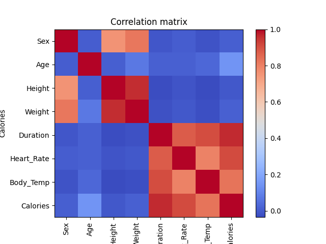
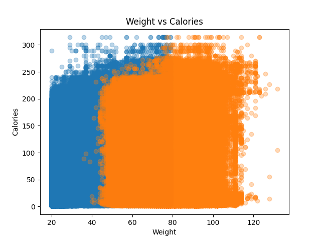
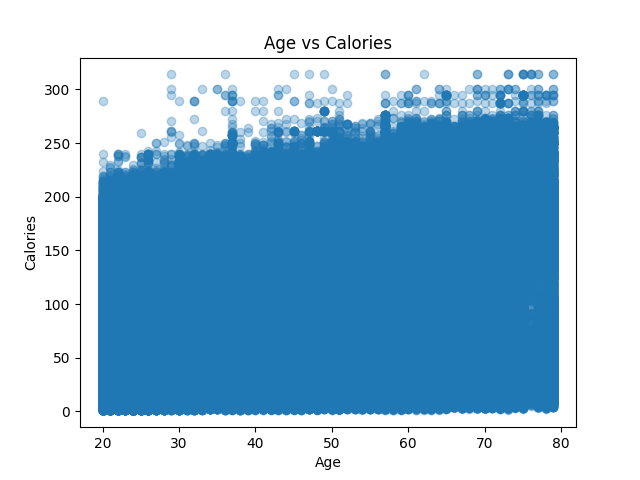
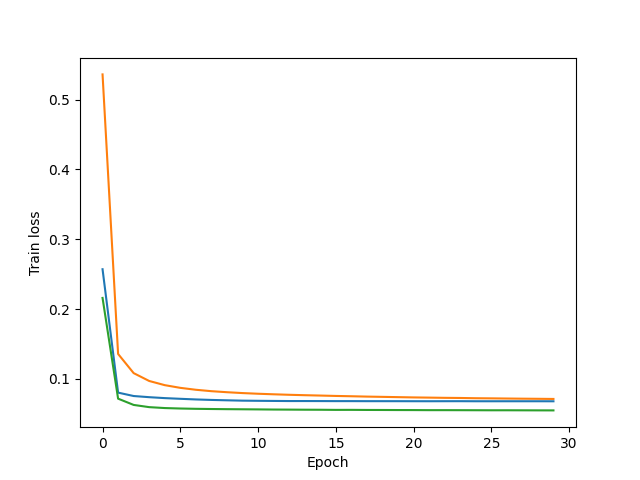
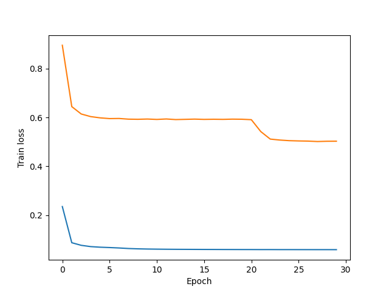
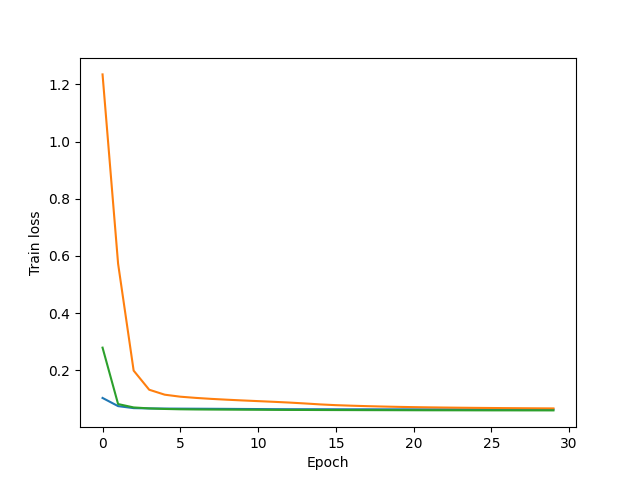
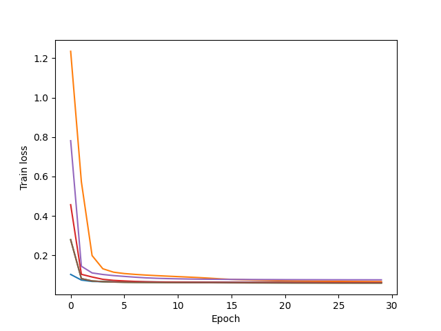
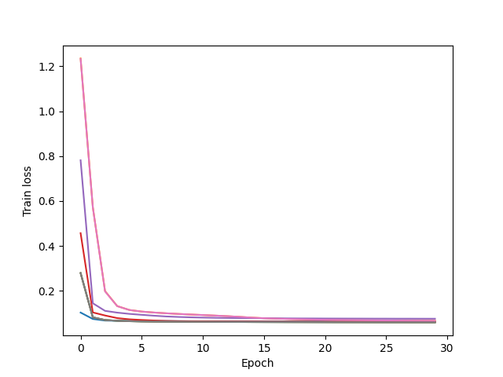

# Calorie Expenditure Prediction S5E5 Kaggle

## Zadania programistyczne
### Wizualizacja danych EDA
Macierz korelacji:


Zależność między kaloriami a wagą:


Zależność między wiekiem a kaloriami:


Z wykresów można odczytać, że intensywność i czas trwania wysiłku fizycznego odgrywają znacznie ważniejszą rolę w zużyciu energii niż dane antropometryczne.

W zależności wagi i spalonych kalorii można rozpatrzyć tendencję, gdzie ludzi z wyższą wagą mają nieco wyższy próg spalonych kalorii. Różnica w przedziałach realistycznych wag człowieka jest minimalna, potwierdzając że waga nie jest głównym czynnikiem.

W zależności wieku i kalorii można rozpatrzyć gęsty rozkład danych, wskazujący że niezależnie od wieku, każdy ma możliwość do spalania równej ilości.

*Wniosek*: z analizy wynika, że głównymi czynnikami w spalaniu są **długość** i **tętno**, a dane antropometrzyczne mają minimalny wpływ lub nieco zerowy.

### Porównania parametrów i modeli
Porównywane [modeli](src/model.py):
 - Small
    - Warstwa ukryta 8 nejronów
    - Aktywacja ReLU
    - Brak dodatkowych warstw i regularizacji
 - Initial (Medium)
    - Dwuwarstwowa 8 + 4
    - Aktywacja ReLU
    - Brak regularizacji
 - Large
    - Dwuwarstwowa 32 + 16
    - Aktywacja ReLU
    - Brak regularizacji
 - Initial + Dropout
   - Identyczna do Initial
   - Dropout p = 0.3

Parametry ustawione:
```yaml
training:
  learning_rate: 1e-3
  epochs: 30
  batch_size: 16
  momentum: 0.9
  seed: 72
```

Porównywanie modeli:

- Pomarańczowy: Small
- Niebieski: Initial
- Zielony: Large

Dropout:

- Pomarańczowy: Initial
- Niebieski: Initial + Dropout

Model **Large** najszybciej osiąga najniższy poziom strat, ponieważ większa liczba neuronów pozwala modelowi lepiej dostosować się do złożonych zależności w danych, gdzie dla **Small** liczba neuronów jest niedostateczna, aby osiągnąć taką samą dokładność.
W przypadku drugiego wykresu wydaje się, że model z **Dropout** działa gorzej , w rzeczywistości jest to zazwyczaj robione po to, aby model lepiej działał na nowych danych, zapobiegając overfittingowi.

#### Hyperparametry
Lista porównywanych hyperparametrów:
```python
hyperparam: dict[str, list] = {
    "learning_rate": [1e-2, 1e-4, 1e-3],
    "batch_size": [32, 64, 16],
    "momentum": [0.0, 0.9]
}
```

Learning rate:

- Niebieski: 0.01
- Zielony: 0.001
- Pomarańczowy: 0.0001

Batch size:

- Brązowy: 16
- Czerwony: 32
- Fioletowy: 64

Momentum:

- Różowy: 0.0
- Szary: 0.9

Zbyt mały learning rate prowadzi do wolnej konwergencji, natomiast zbyt duży może powodować niestabilność.

Batch size = 32 zapewnia najlepszą równowagę pomiędzy stabilnością uczenia a zdolnością generalizacji.

Zastosowanie momentum znacząco przyspiesza proces uczenia i stabilizuje optymalizację.

### Predykcja
Na podstawie eksperymentów została wybrana model **Initial + Dropout** z [parametrami](src/config/config.yaml):
```yaml
training:
  learning_rate: 1e-3
  epochs: 30
  batch_size: 16
  momentum: 0.9
  seed: 72
```

Skrypt [predict.py](src/predict.py) generuje [submission.csv](data/submission.csv) na podstawie danych z [test.csv](data/test.csv) i przedstawionego modelu.

Po załadowaniu pliku końcowego na strone konkursu model otrzymała wynik:


## Zadania teoretyczne

## Zadanie 1 

### Inicjalizacja 0.0

Forward pass:
```
z1 = W1·[2,3]ᵀ + b1 = [0,0]ᵀ
a1 = ReLU([0,0]ᵀ) = [0,0]ᵀ
z2 = W2·a1 + b2 = 0
ŷ = 0
L = (0-5)² = 25
```

Backward pass:
```
∂L/∂ŷ = 2(ŷ-y) = -10
∂L/∂W2 = -10·a1ᵀ = [0,0]
∂L/∂b2 = -10
∂L/∂a1 = -10·W2ᵀ = [0,0]ᵀ
∂L/∂z1 = [0,0]ᵀ (ReLU' w 0)
∂L/∂W1 = [[0,0],[0,0]]
∂L/∂b1 = [0,0]ᵀ
```

### Inicjalizacja 1.0

Forward pass:
```
z1 = [[1,1],[1,1]]·[2,3]ᵀ + [1,1]ᵀ = [2+3+1, 2+3+1]ᵀ = [6,6]ᵀ
a1 = ReLU([6,6]ᵀ) = [6,6]ᵀ
z2 = [1,1]·[6,6]ᵀ + 1 = 6+6+1 = 13
ŷ = 13
L = (13-5)² = 64
```

Backward pass:
```
∂L/∂ŷ = 2(13-5) = 16

∂L/∂W2 = 16·a1ᵀ = 16·[6,6] = [96, 96]
∂L/∂b2 = 16

∂L/∂a1 = 16·W2ᵀ = 16·[1,1]ᵀ = [16,16]ᵀ
∂L/∂z1 = [16,16]ᵀ ⊙ [1,1]ᵀ = [16,16]ᵀ (ReLU'(6)=1)

∂L/∂W1 = [16,16]ᵀ·[2,3] = [[32,48],
                            [32,48]]
∂L/∂b1 = [16,16]ᵀ
```

### Wniosek

Sieć neuronowa jest w stanie uczyć wtedy i tylko wtedy gdy inicjalizacja jest różna od zera. Inaczej:
 - Wszystkie wagi mają gradient 0
 - Tylko b2 ma gradient rożny od 0
 - Problem martwych neuronów ReLU
 - Brak łamania symetrii

## Zadanie 2

### Dlaczego nie można napisać ręcznie programu z if'ami?

- Sieci mają tysiące parametrów (nie da się wyrazić if'ami)
- Brak jawnych reguł - wiedza rozproszona w wagach
- Funkcje ciągłe vs dyskretne granice if'ów
- Wykładnicza złożoność warunków

### 2. Po co funkcje aktywacji?

Bez aktywacji
Wielowarstwowa sieć nie otrzymuje benefitów wszystkich warstw

Z aktywacją (ReLU, Sigmoid)
- Wprowadzają nieliniowość
- Umożliwiają aproksymację złożonych funkcji
- Tworzą hierarchię cech
- Universal approximation theorem

### Rola dropout'u

Losowo wyłącza neurony z prawdopodobieństwem *p* podczas treningu
- Zapobiega overfittingowi
- Wymusza redundantne reprezentacje
- Zwiększa generalizację

## Autorzy
- Nazarii Dmytryshyn    29179
- Andrii Kaplan         29161
- Heorhii Parfenchyk    29195
- Sviatoslav Rudkovskyi 30294